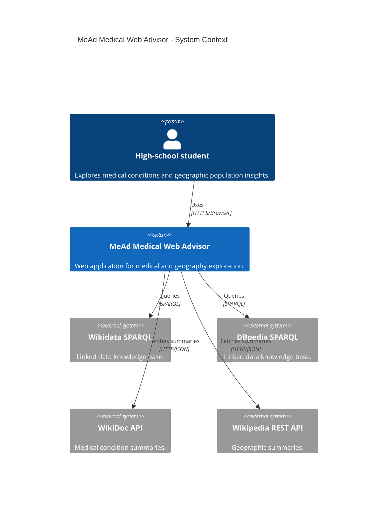
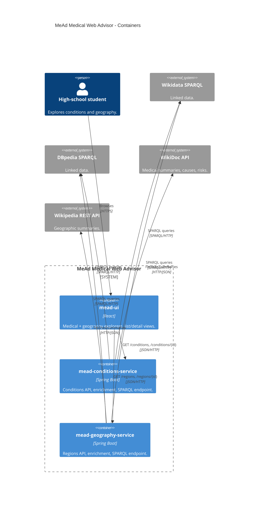
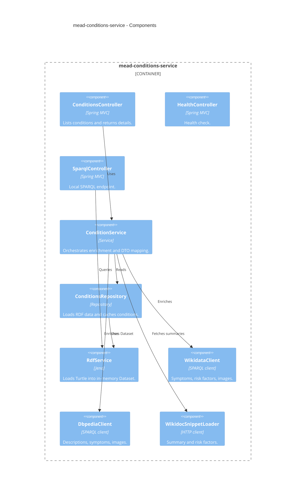
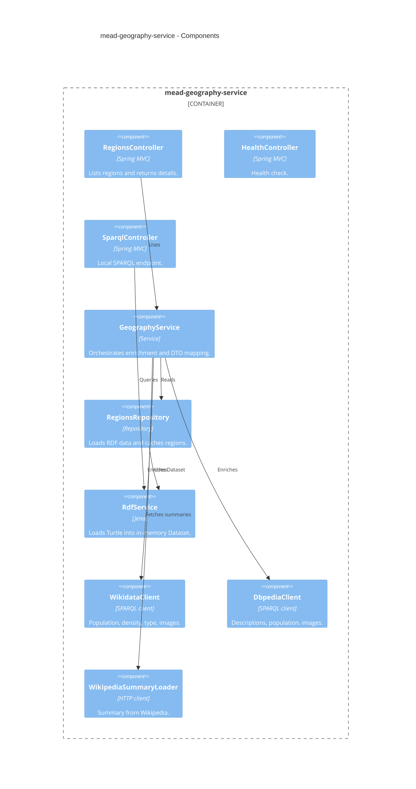

# C4 Architecture Diagrams

These diagrams describe the service-oriented architecture of MeAd from a software engineering perspective. They cover the main modules, input/output formats, and data flows for end users.

## C4 Context Diagram

## C4 Container Diagram

## C4 Component Diagram - Conditions Service

## C4 Component Diagram - Geography Service

## Input/Output Data Formats

- Conditions API and Geography API: JSON responses for list/detail endpoints.
- SPARQL endpoints: `application/sparql-results+json` for SELECT/ASK and `text/turtle` for CONSTRUCT/DESCRIBE.
- External sources:
  - Wikidata/DBpedia via SPARQL.
  - WikiDoc and Wikipedia via HTTP JSON APIs.

## Data and Task Flow (high level)

1. User searches or selects an entity in the web UI.
2. UI calls the appropriate service endpoint (`/conditions/{id}` or `/regions/{id}`).
3. Service reads base entity data from the local RDF dataset.
4. Service enriches the entity using external sources.
5. Service returns a normalized JSON response to the UI.
